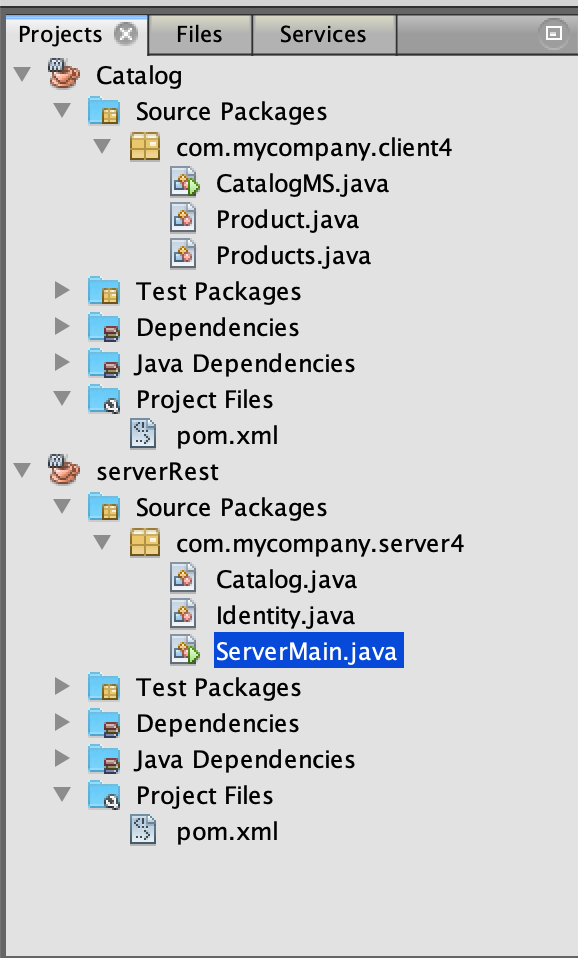

# RabbitMQ

## Guide

### Server

    @XmlRootElement(name = "Catalog")
    public class Catalog {
        private static List<String> catalogList;
        private final static String queueName = "CATZ_CATALOG";
        private final static String queueNameRet = "CATZ_CATALOG_RET";
        private String message = "DammeErCatalogo";
        private String messageRet;
    
    		@GET
        @Path("catalog")
        public List<String> getCatalog() throws Exception{
            //SEND MESSAGE
            ConnectionFactory factory = new ConnectionFactory();
            factory.setHost("127.0.0.1");
            try (Connection connection = factory.newConnection();
                Channel channel = connection.createChannel()) {
                    channel.queueDeclare(queueName, false, false, false, null);
                    channel.basicPublish("", queueName, null, message.getBytes());
                }
            
            //RECEIVE RESPONSE
            ConnectionFactory factoryRet = new ConnectionFactory();
            factoryRet.setHost("127.0.0.1");
            Connection connectionRet = factoryRet.newConnection();
            Channel channel = connectionRet.createChannel();
            channel.queueDeclare(queueNameRet, false, false, false, null);
            DeliverCallback deliverCallback = (consumerTag, delivery) -> {
                String messageRet = new String(delivery.getBody(), "UTF-8");
                System.out.println(" [x] Received '" + messageRet + "'");
                this.messageRet = messageRet;
            };
            channel.basicConsume(queueNameRet, true, deliverCallback, consumerTag -> { });
            return new ArrayList<>();
        }
    
    }

### Client

    public class CatalogMS {
        private final static String QUEUE_NAME = "CATZ_CATALOG";
        private final static String QUEUE_NAME_RET = "CATZ_CATALOG_RET";
        private final static String HOST = "127.0.0.1";
    
        public static void main(String[] argv) throws Exception {
            
            //CONNECTION
            ConnectionFactory factory = new ConnectionFactory();
            factory.setHost(HOST);
            Connection connection = factory.newConnection();
            Channel channel = connection.createChannel();
    
            // RECEIVE QUEUE
            channel.queueDeclare(QUEUE_NAME, false, false, false, null);
            System.out.println(" [*] Waiting for messages. To exit press CTRL+C");
    
            DeliverCallback deliverCallback = (consumerTag, delivery) -> {
                String message = new String(delivery.getBody(), "UTF-8");
                System.out.println(" [x] Received '" + message + "'");
                if(message.equals("DammeErCatalogo")){
                    System.out.println("\t->Sending Catalog");
                    channel.basicPublish("", QUEUE_NAME_RET, null,jcat.toString().getBytes("UTF-8"));
                System.out.println(" [x] Sent '" + message + "'");
                    
                }
            };
            // SEND QUEUE
                channel.queueDeclare(QUEUE_NAME_RET, false, false, false, null);
                
            // START CONSUME
            channel.basicConsume(QUEUE_NAME, true, deliverCallback, consumerTag -> { });
            
        }
    }

## Server

### Main

    public class ServerMain {
        public static void main(String[] args) throws Exception{
            Identity auth = new Identity();
            Catalog catalogo = new Catalog();
            auth.getToken();
            catalogo.getCatalog();
        }
    }

### Catalog

    @XmlRootElement(name = "Catalog")
    public class Catalog {
        private static List<String> catalogList;
        //private final Channel queue;
        //private final Channel queueRet;
        private final static String queueName = "CATZ_CATALOG";
        private final static String queueNameRet = "CATZ_CATALOG_RET";
        private String message = "DammeErCatalogo";
        private String messageRet;
    
        public static List<String> getCatalogList() {
            return catalogList;
        }
    
        public static void setCatalogList(List<String> catalogList) {
            Catalog.catalogList = catalogList;
        }
        
        @GET
        @Path("catalog")
        public List<String> getCatalog() throws Exception{
            //SEND MESSAGE
            ConnectionFactory factory = new ConnectionFactory();
            factory.setHost("192.168.49.81");
            try (Connection connection = factory.newConnection();
                Channel channel = connection.createChannel()) {
                    channel.queueDeclare(queueName, false, false, false, null);
                    //queue = channel;
                    channel.basicPublish("", queueName, null, message.getBytes());
                }
            
            //RECEIVE RESPONSE
            ConnectionFactory factoryRet = new ConnectionFactory();
            factoryRet.setHost("192.168.49.81");
            Connection connectionRet = factoryRet.newConnection();
            Channel channel = connectionRet.createChannel();
            channel.queueDeclare(queueNameRet, false, false, false, null);
            DeliverCallback deliverCallback = (consumerTag, delivery) -> {
                String messageRet = new String(delivery.getBody(), "UTF-8");
                System.out.println(" [x] Received '" + messageRet + "'");
                this.messageRet = messageRet;
            };
            channel.basicConsume(queueNameRet, true, deliverCallback, consumerTag -> { });
            return new ArrayList<>();
        }
    
    }

### Identity

    @XmlRootElement(name = "Identity")
    public class Identity {
        private final static String queueName = "CATZ_AUTH";
        private final static String queueNameRet = "CATZ_AUTH_RET";
        private String message = "user:pw";
        private String messageRet;
        
        public void getToken() throws Exception{
            //SEND MESSAGE
            ConnectionFactory factory = new ConnectionFactory();
            factory.setHost("192.168.49.81");
            try (Connection connection = factory.newConnection();
                Channel channel = connection.createChannel()) {
                    channel.queueDeclare(queueName, false, false, false, null);
                    //queue = channel;
                    channel.basicPublish("", queueName, null, message.getBytes());
                }
            
            //RECEIVE RESPONSE
            ConnectionFactory factoryRet = new ConnectionFactory();
            factoryRet.setHost("192.168.49.81");
            Connection connectionRet = factoryRet.newConnection();
            Channel channel = connectionRet.createChannel();
            channel.queueDeclare(queueNameRet, false, false, false, null);
            DeliverCallback deliverCallback = (consumerTag, delivery) -> {
                String messageRet = new String(delivery.getBody(), "UTF-8");
                System.out.println(" [x] Received '" + messageRet + "'");
                this.messageRet = messageRet;
            };
            channel.basicConsume(queueNameRet, true, deliverCallback, consumerTag -> { });
        }
    
        public String getMessageRet() {
            return messageRet;
        }
    
        public void setMessageRet(String messageRet) {
            this.messageRet = messageRet;
        }
    }

## Client

### IdentityService

    class TokenMapEntry {
        long token;
        long timestamp;
        TokenMapEntry(long token, long timestamp) {
            this.token = token;
            this.timestamp = timestamp;
        }
    }
    
    public class IdentityService {
        private final static String QUEUE_AUTH = "CATZ_AUTH";
        private final static String QUEUE_AUTH_RET = "CATZ_AUTH_RET";
        private final static String QUEUE_VERIFY = "CATZ_VERIFY";
        private static final Map<String, TokenMapEntry> users_tokens = new HashMap<>();
        private static final Map<String, String> users_pw = new HashMap<>();
        private static final Random RND = new Random(42);
        
        public static void main(String[] args) throws Exception{
            ConnectionFactory factory = new ConnectionFactory();
            factory.setHost("192.168.49.81");
            Connection connection = factory.newConnection();
            Channel channel = connection.createChannel();
            
            channel.queueDeclare(QUEUE_AUTH, false, false, false, null);
            channel.queueDeclare(QUEUE_AUTH_RET, false, false, false, null);
            channel.queueDeclare(QUEUE_VERIFY, false, false, false, null);
            
            DeliverCallback authCallback = (consumerTag, delivery) -> {
                String message = new String(delivery.getBody(), "UTF-8");
                System.out.println(" [x] Received in AUTH'" + message + "'");
                
                // retrieve user and pw
                String[] msg_split = message.split(":");
                if (msg_split.length != 2) {
                    System.out.println("skipping message "+message);
                    return;
                }
                String user = msg_split[0];
                String pw = msg_split[1];
                
                try {
                    MessageDigest digest = MessageDigest.getInstance("SHA-256");
                    byte[] hash = digest.digest(pw.getBytes(StandardCharsets.UTF_8));
                    String hash_str = bytesToHex(hash);
                    System.out.println("hashed "+hash_str);
                    
                    // hash from db
                    Boolean user_contained = users_pw.containsKey(user);
                    if (!user_contained) {
                        System.out.println("not in db");
                        return;
                    }
    
                    String true_hash = users_pw.get(user);
                    
                    if (true_hash.equals(hash_str)) {
                        System.out.println("authenticated");
                        long new_token = RND.nextLong();
                        long timestamp = System.currentTimeMillis();
                        TokenMapEntry entry = new TokenMapEntry(new_token, timestamp);
                        users_tokens.put(user, entry);
                        channel.basicPublish("", QUEUE_AUTH_RET, null, String.valueOf(new_token).getBytes("UTF-8"));
                        System.out.println("new token "+String.valueOf(new_token));
                    } else {
                        System.out.println("not authenticated");
                        channel.basicPublish("", QUEUE_AUTH_RET, null, "NO".getBytes("UTF-8"));
                    }
    
                } catch (NoSuchAlgorithmException ex) {
                    System.out.println("mucho errore");
                }
                
            };
            
            DeliverCallback verifyCallback = (consumerTag, delivery) -> {
                String message = new String(delivery.getBody(), "UTF-8");
                System.out.println(" [x] Received in VERIFY'" + message + "'");
            };
            
            channel.basicConsume(QUEUE_AUTH, true, authCallback, consumerTag -> { });
            channel.basicConsume(QUEUE_VERIFY, true, authCallback, consumerTag -> { });
            
            String dummy_hash = "30C952FAB122C3F9759F02A6D95C3758B246B4FEE239957B2D4FEE46E26170C4";
            users_pw.put("user", dummy_hash);
            String message = "user:pw";
            channel.basicPublish("", QUEUE_AUTH, null, message.getBytes("UTF-8"));
            System.out.println("message sent");
        }
        
        private static String bytesToHex(byte[] hash) {
            return DatatypeConverter.printHexBinary(hash);
        }
    }

### CatalogMS

    public class CatalogMS {
        private final static String QUEUE_NAME = "CATZ_CATALOG";
        private final static String QUEUE_NAME_RET = "CATZ_CATALOG_RET";
        private final static String HOST = "192.168.49.81";
    
        public static void main(String[] argv) throws Exception {
            
            // CREATE PRODUCTS
            Products prod = new Products();
            for(int i=0;i<10;i++)prod.addProduct("Control");
            for(int i=0;i<10;i++)prod.addProduct("Durex");
            for(int i=0;i<10;i++)prod.addProduct("Akuel");
            for(int i=0;i<10;i++)prod.addProduct("Pesante");
            for(int i=0;i<10;i++)prod.addProduct("Esp");
            for(int i=0;i<10;i++)prod.addProduct("Masculan");
            for(int i=0;i<10;i++)prod.addProduct("Serena");
            
            // JSON CATALOG
            JsonArray jcat = new JsonArray();
            List<Product> lprods = prod.getProducts();
            for(int i=0;i<lprods.size();i++){
                Product p = lprods.get(i);
                JsonObject jp = new JsonObject();
                jp.addProperty("name", p.getName());
                jp.addProperty("id", p.getId());
                jcat.add(jp);
            }
            //-------------------------------------------------
            ConnectionFactory factory = new ConnectionFactory();
            factory.setHost(HOST);
            Connection connection = factory.newConnection();
            Channel channel = connection.createChannel();
    
            // RECEIVE QUEUE
            channel.queueDeclare(QUEUE_NAME, false, false, false, null);
            System.out.println(" [*] Waiting for messages. To exit press CTRL+C");
    
            DeliverCallback deliverCallback = (consumerTag, delivery) -> {
                String message = new String(delivery.getBody(), "UTF-8");
                System.out.println(" [x] Received '" + message + "'");
                if(message.equals("DammeErCatalogo")){
                    System.out.println("\t->Sending Catalog");
                    channel.basicPublish("", QUEUE_NAME_RET, null,jcat.toString().getBytes("UTF-8"));
                System.out.println(" [x] Sent '" + message + "'");
                    
                }
            };
            // SEND QUEUE
                channel.queueDeclare(QUEUE_NAME_RET, false, false, false, null);
    
                
            // START CONSUME
            channel.basicConsume(QUEUE_NAME, true, deliverCallback, consumerTag -> { });
            
        }
    }

### Products

    public class Products{
        private ArrayList<Product> products;
        public Products(){
            products = new ArrayList<Product>();
        }
        
        public void addProduct(String name){
            Stream<Product> stream = this.products.stream();
            Stream<Integer> ids = stream.map(p -> new Integer(p.getId()));
     
            Object[] idsArray;
            idsArray = ids.toArray();
            Random rand = new Random();
            int idx;
            while(true){
                idx = rand.nextInt();
                boolean used = false;
                for (int i = 0;i<idsArray.length;i++){
                    if(idsArray[i].equals(new Integer(idx))){
                        used = true;
                        break;
                    }
                }
                if(!used)break;
                else continue;  
            }
            Product p = new Product(idx,name);
            this.products.add(p);
     
        }
        
        public List<Product> getProducts(){
            return (List<Product>)this.products.clone();
        }
    }

### Product

    public class Product {
        final private int id;
        private String Name;
        
        public Product(int id,String Name){
            this.id = id;
            this.Name = Name;
        }
        
        public int getId(){return this.id;}
        public String getName(){return this.Name;}
        
    }